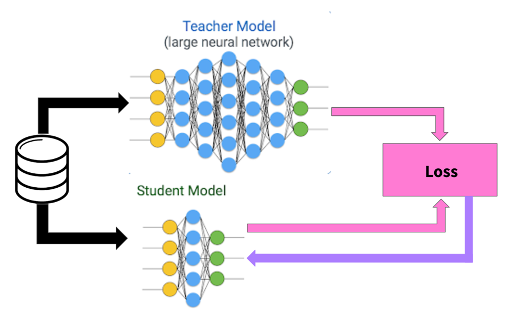
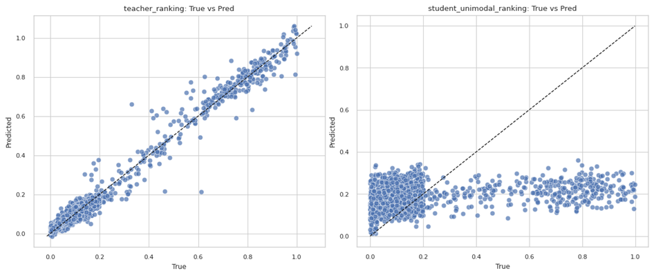
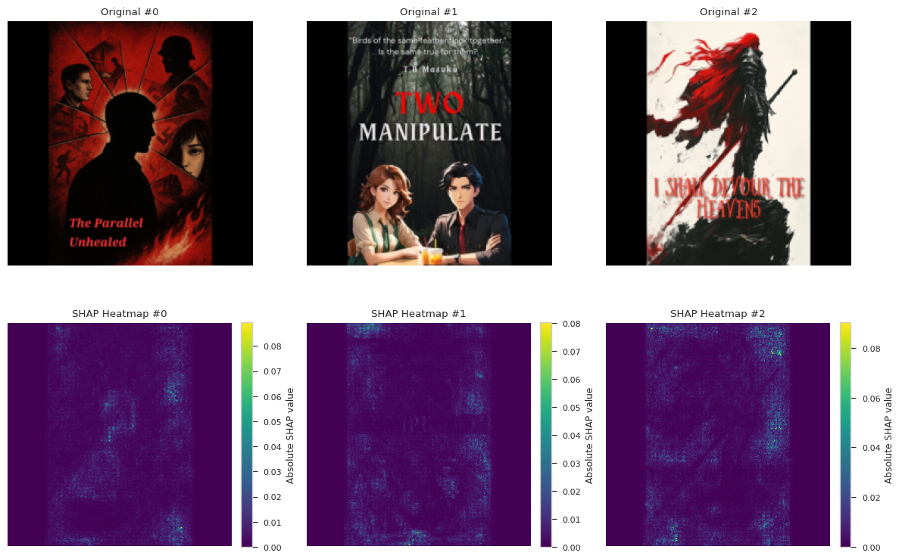
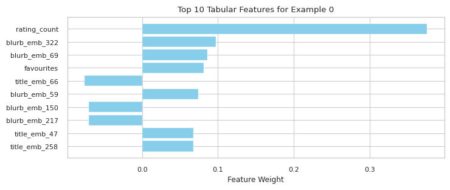
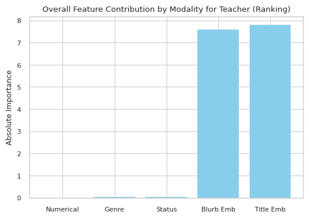
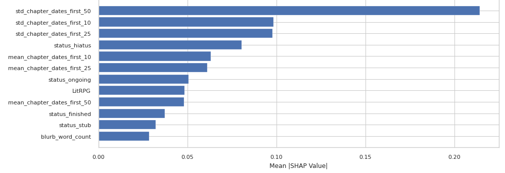
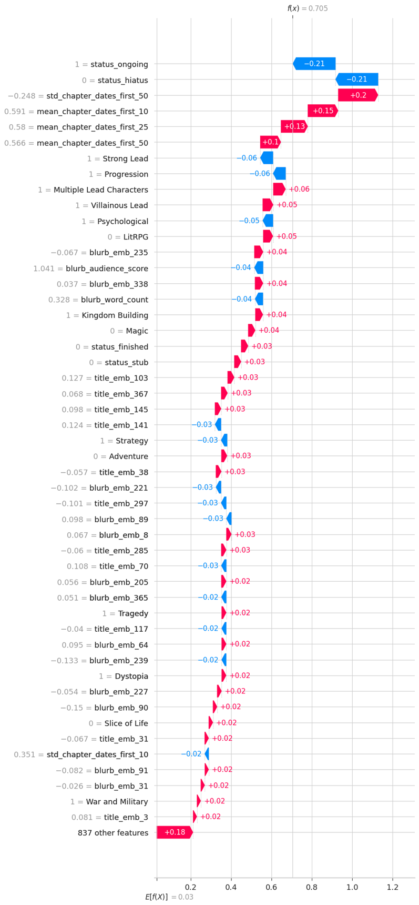

*Read the technical paper [here](paper.pdf).*

*Edit 12/18/2025: This post has been updated to reflect some additional work. See [Additional Research](#additional-research).*

# Introduction

When people think of “books”, they likely imagine something physical, with dozens to hundreds of pages that you can cut your fingers on. They may also lump in text digitized to e-books or even include audiobooks in their own personal definition. 

There is, however, another form of literature that is distinct enough from the standard definition of books: **web fiction**. 

Web fiction, also known as web serials, is a growing domain of literature that is almost exclusively published digitally online. Unlike traditional literature, these stories tend to be released in serialized installments, hence the name, by new or aspiring authors with comparatively looser quality control. For some writers, this can be a stepping stone to self-publishing an e-book or working with traditional publishers.

This domain has garnered increasing popularity over the years. Sites like Royal Road, Scribble Hub, and Wattpad gather millions of readers across the globe. In China specifically, almost 500 million citizens are reported to read web fiction. 

Yet despite this scale, web fiction remains understudied in academic research. While there are numerous studies exploring book recommendation and rating systems, they mainly concern traditionally published literature.

I want to answer the following question today: **can you predict reader rankings from web fictions’ metadata and book cover?**

TLDR: [skip to the results](#key-results).

# Methodology

To be more specific, I am defining a story’s “ranking” as its position on a website. For example, at time of writing, *[Mother of Learning](https://www.royalroad.com/fiction/21220/mother-of-learning)* is the top ranked story on Royal Road, which means it has a ranking of 1, or at the top 0.000833% of all stories on the site.

From a data mining/machine learning view, this is a standard regression problem, or a task where you try to predict a number. There are many approaches that can be taken, but the first step is the same.

You need data.

## Data Collection

But unlike with many machine learning or data mining projects, however, there aren’t exactly comprehensive datasets that are publicly available. Given that these sites’ business models often revolve around being the one serving stories to readers, this makes perfect sense. Sites that host web fiction also rarely have public APIs, or interfaces for developers, to access their data.

This isn’t a major obstacle, though. After all, the site still actually needs to send stories to readers to be functional. It’s possible to collect the necessary information by making automated web crawlers that mimic the behaviour of human readers, gathering all the data for the project.

Of course, many sites actively prohibit this kind of scraping or crawling behaviour. Disclaimer: **I contacted sites with data access requests**. If you want to reproduce the results of this project, you also need to make the same requests.

I contacted Royal Road, Scribble Hub, and Wattpad for permission to gather data. Royal Road gave tentative permission, Scribble Hub never replied (but also did not prohibit collection), and Wattpad declined the request.

In total, the bulk of the data I collected came from Royal Road supplemented with entries from Scribble Hub.

The following data was collected:

| Field | Description |
| ----- | ----- |
| *Title* | The name of the story. |
| *Author* | The author of the story. |
| *Cover* | The cover image of the story. |
| *Blurb* | The short description of the story. |
| *Genres* | The genres of the story. |
| *Status* | Whether the story is ongoing, finished, on hiatus, or partially published as a sample. |
| *Chapter Count* | The total number of chapters published. |
| *Word Count* | The total number of words published. |
| *Ranking* | The position of the story on the website (i.e. \#1 of all time). |
| *Rating* | The user-given review score (from 1 to 5). |
| *Rating Count* | The total number of user-given ratings. |
| *Views* | The total number of views on the story. |
| *Favourites* | The total number of people who favourited, or liked, the story. |
| *Chapter Dates* | The dates of publication for the first fifty chapters of the story. |
| *Chapter Names* | The names of the first fifty chapters of the story. |

After collecting all the raw data, it’s time to process it.

## Data Preprocessing

Data preprocessing involves cleaning up the data and turning into a format more suited for machine learning. Again, the exact steps are listed in the [write-up](paper.pdf).

What’s more interesting is exploring the impact of certain conventions that authors employ more in web fiction than in traditional literature. Stories often embed the genre directly into the title or description for readers to see. They include the release schedule, the story expectations, and even the target audience in the blurb.

During this initial attempt, I attempted to mine these features using some basic machine learning techniques that ultimately did not pan out. While I would like to reexamine this in the future, for now it seems that these aspects of a story do not seem to play a large role in predicting readers’ rankings.

## Regression Models

The final step is to build models on the dataset. 

A large model was trained on stories’ cover image and metadata. This model then acts as a teacher for a smaller student model that could only look at story images.

|  |
|:--:|

This setup allows for examining how impactful images are on rankings.

# Discussion

## Results

When given both the stories’ metadata and images, the teacher is accurate enough to guess a stories’ true ranking within 3 percentile points, on average. It can explain 98% of all the variance, or uncertainty, in the dataset.

On the other hand, the student that was trained only on images has an error in the range of around 22 percentile points. While that may still sound somewhat acceptable, the fact is that the dataset is skewed, containing more top rated stories than lower rated ones. Combined with the fact that it only captures 27% of the variance, the student hasn’t actually learned anything besides guessing the average ranking of the entire dataset.

The following image showcases this well:

|  |
|:--:|

We can see that the teacher is relatively accurate across the range of different values. But for the student, it makes the same predictions independent of what it is actually seeing from the image.

When visualizing how models see the book images, we can see how much individual pixels affect predictions, with bright green to lime representing highly influential points.

|  |
|:--:|

But the following sample images showcase mostly dark blue pixels, indicating that the models don’t seem to find any useful information from cover images.

On the other hand, the teacher model places considerably more weight on the metadata. This visual showcases the most important features for a teacher’s example prediction.

|  |
|:--:|

We see that the number of ratings and favourites play a large role influencing predictions. The title and blurb also seem to be highly impactful. When visualizing the collective impact of the title and blurb, we see that they outnumber every other feature combined:

|  |
|:--:|

<h1 id='key-results'>Key Results</h1>

* Logically, stories with more ratings, favorites, or views tend to score higher, which makes intuitive sense.  
* The speed and consistency of early chapter releases are correlated weakly with ratings.  
* Cover images are unimportant.  
* Story titles and blurbs strongly influenced predictions.

## Limitations

The study focused mainly on Royal Road and, to a lesser extent, Scribble Hub. Because the dataset is limited, results may not fully generalize to other web serial platforms. Portal fantasy, for example, is a relatively niche genre in traditional media, but highly concentrated in this dataset, leading to it being a relatively impactful feature.  
There are also features we didn’t include that could be highly predictive. Community engagement metrics, such as subscriber counts, “time read,” or discussion activity, could offer richer signals of story quality. Expanding to more platforms and gathering these features could improve predictions and generalizability.

# Takeaways

A not insignificant part of a story’s reception is tied to its popularity in terms of views, reviews, and engagement. In a cynical way, it almost seems like to be well received, you must already be a well-established and popular author.

Of course, that does not accurately reflect the truth. Though the models confirm that higher-quality stories tend to receive higher ratings, the most important and actionable insights are simple:

1. Focus on the title and blurb. These have the strongest influence on predicted ratings.  
2. Chapter timing is slightly important. ~~There are hints that update patterns relate to ranking, but nothing to base a strategy on.~~
3. Cover art is less critical than you might think. Like what prior research suggests, readers care more about content cues than visual design.

So while it seems that people do, in fact, not judge stories by their cover, they will, in fact, place a large emphasis on a web serial’s title and blurb.  

<h1 id="additional-research">12/18/2025 — Additional Research</h1>

After writing this post, I realize that a potential use case of this research is to provide an objective measure against which potential authors can use to evaluate their work.

This makes the previously described work less valuable as some metrics, like views, favourites, and ratings, would be unavailable to them.

To address this, I’ve taken the liberty to train and evaluate another model purely with information that an author would have before a story releases.

This model’s performance is worse, with an average error within 14 percentile points and can only explain around 62% of the variance within the dataset However, it reflects similar trends as the previous models.

Blurbs and titles are still the most influential features for predicting ranking. There are, however, some features that show up as more influential than before.

Where previously, the chapter release timings were more nebulous, there is a clear trend:

|  |
|:--:|

When viewing how much the individual features influence predictions, we see:

|  |
|:--:|
| Negative values correspond to rankings closer to 0, which represent the most popular stories. So increasing blue features means increasing ranking. |

Generally, you can conclude:
1. Releasing chapters faster is better, particularly for the first 10 installments.
2. High consistency in release schedules matters for the first 50 chapters, but this relationship falls off for the first 10 or 25 chapters. 
3. Higher word counts in the blurb slightly improve the model’s predicted rating.

As a final statement, this research is intended to help authors be data-informed and inspire future work into this field. The information given reflects general observations and shouldn’t be relied on blindly to make decisions or strategies.

# References
- [Writeup](paper.pdf) 
- [Code](https://github.com/JamesG9802/web-serial-regression)